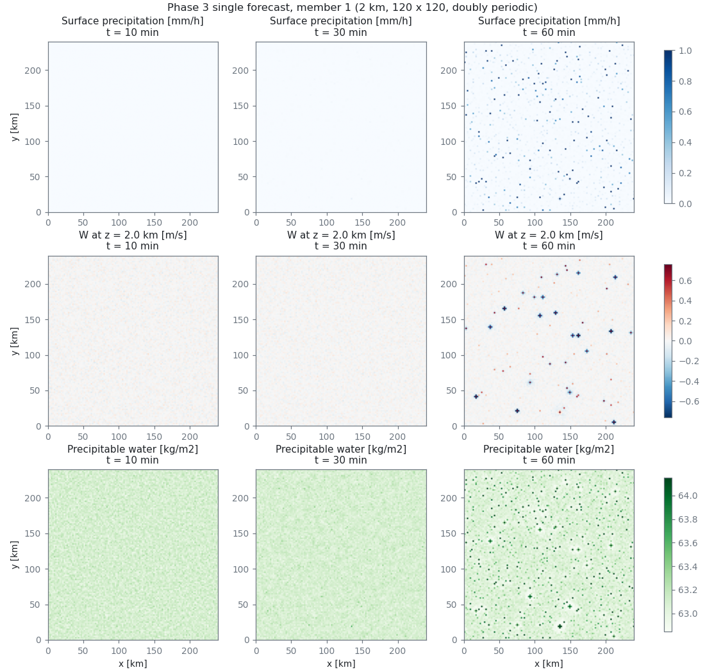
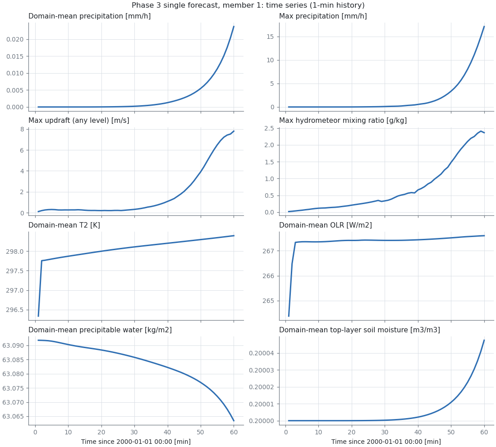
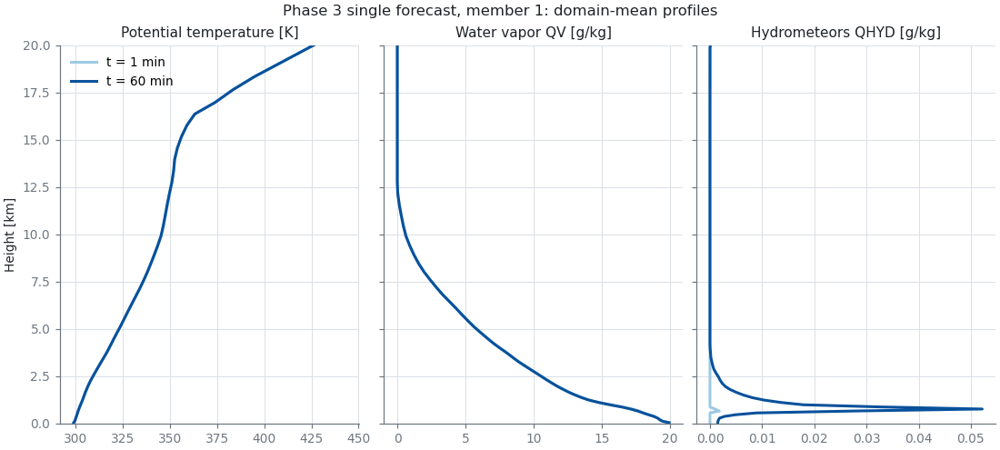

# Phase 3 — 1 member × 1 時間の単独予報（2026-09-25 実行）

## 実行したもの

| 項目 | 内容 |
| --- | --- |
| 設定ファイル | `convection/phase3/run.conf`（rep_asakura の `run.conf` から、時刻・入出力のパスだけを変えたもの） |
| ジョブスクリプト | `convection/phase3/run.sh` |
| 実行ファイル | `bin/scale-rm`（md5 `6c69009e...`、`docs/phase0/executables.txt` と同じ） |
| 初期値 | rep_asakura の `1/init_20000101-000000.000`（member 1） |
| 期間 | 2000-01-01 00:00 から 1 時間（600 ステップ、`TIME_DT = 6 s`） |
| 資源 | debug-o、36 ノード、144 プロセス × 12 スレッド |
| 出力先 | `/work/gv42/v42013/20260923_enkc_convection/result/phase3_fcst1h/`（`history/1/`, `refstate/1/`, `restart/1/` に種類ごと・member ごとに分けた。実行時は直下に出したものを実行後に移動した） |
| 実行日時 | 2026-09-25 14:42:12 – 14:42:33 |

## 結果

**正常終了した**（`exit status: 0`、1 時間後の restart `restart_20000101-010000.000` を出力）。
この設定で予報を最後まで回したのは今回が初めて（rep_asakura では初期値が見つからずに 1 ステップ目で止まっていた）。

### 実行時間

| 項目 | 時間 |
| --- | --- |
| ジョブ全体（`job.out` の開始 – 終了） | **21 秒** |
| 積分ループ（`Main_Loop`） | 16.8 秒 |
| 　うち history の書き出し（`FILE_HISTORY_OUT`） | 7.3 秒（**約 45%**） |
| 　うち力学（`ATM_Dynamics`） | 4.8 秒 |
| 　うち放射（`ATM_Radiation`） | 1.7 秒 |
| 初期化（`Initialize`） | 1.1 秒 |

LOG の進み方はほぼ一定だった（100 ステップ目 3.8 秒、300 ステップ目 8.7 秒、600 ステップ目 16.7 秒）。

### 出力の大きさ（1 member・1 時間）

| 種類 | 大きさ | 備考 |
| --- | --- | --- |
| history | **6.7 GB** | 60 秒ごと × 60 回、108 項目 |
| restart | 204 MB | 1 時間後の 1 回分 |
| refstate | 121 MB | |

### 値の確認

restart の 2 つのプロセス分（pe000000, pe000077）で、NaN がないこと、値が妥当な範囲にあることを確認した。

| 変数 | 最小 | 最大 |
| --- | --- | --- |
| DENS | 0.058 | 1.149 |
| MOMZ | -0.32 | 1.98 |
| QV | 7.3e-9 | 0.020 |
| QC | 0 | 8.2e-4 |
| QR | 0 | 1.2e-4 |
| LAND_WATER | 0.200 | 0.202 |
| LAND_TEMP | 280 | 286.6 |

`monitor.peall` の値はすべて 0 だった。
`MONITOR_STEP_INTERVAL = 3600` が 600 ステップより長く、1 ステップ目しか出ていないため。予報の異常ではない。

### 図

`convection/phase3/plot_fcst1h.py` で作成した（144 プロセス分の history をつなげて 120 × 120 格子に戻して描いている）。

| 量 | 1 分 | 60 分 |
| --- | --- | --- |
| 領域平均降水 [mm/h] | 0 | 0.024 |
| 最大降水 [mm/h] | 0 | 17.1 |
| 最大上昇流（全高度） [m/s] | 0.12 | 7.8 |
| 最大水物質混合比 [g/kg] | 0.018 | 2.4 |
| 領域平均 T2 [K] | 296.3 | 298.4 |
| 領域平均 OLR [W/m2] | 264.4 | 267.6 |
| 領域平均可降水量 [kg/m2] | 63.09 | 63.06 |
| 領域平均土壌水分（最上層） [m3/m3] | 0.20000 | 0.20005 |

**読み取れること**

- 前半 30 分はほぼ静穏で、40 分ごろから小さな対流セルが領域全体にばらばらに立ち上がり、60 分で最大上昇流 7.8 m/s・最大降水 17 mm/h まで発達している。
  初期値の温位のランダム摂動（`RANDOM_THETA`）から対流が始まる、理想化実験として自然な振る舞い。
- 60 分の時点では、セルの多くは 1–2 格子（2–4 km）の大きさで、まだ発達の初期段階。
- 領域平均の QHYD は高度 0.8 km 付近に集中しており、浅い雲が先にできている。
- 土壌水分は降水のあった格子でわずかに増えている（0.20000 → 0.20005）。陸面と大気の結合は働いている。
- **T2 と OLR が最初の 1–2 分で跳ねている**（T2: 296.3 → 297.8 K、OLR: 264 → 267 W/m2）。
  その後はなめらかに推移するので、初期値の地表面・放射の状態とモデルのつり合いがずれていることによる初期の調整と考えられる。
  スピンアップなしで cycle を始める（Phase 0-4 の決定）ことに伴うもの。cycle の最初の数 cycle の結果を見るときに注意する。

---

## 1 cycle の所要時間の見積もり

| 処理 | 見積もり | 根拠 |
| --- | --- | --- |
| step 3 予報（22 run を並列） | 約 20 秒 | 今回の実測（1 run 21 秒）。並列なので 22 run でもほぼ同じ |
| step 4 LETKC | 1 分程度 | case_tc では 14 秒。格子数が多いので長めに見る |
| step 7 予報（やり直し） | 約 20 秒 | step 3 と同じ |
| step 8 obsmake | 数十秒 | case_tc では 5 秒 |
| step 10 LETKF | 1 分程度 | case_tc では 14 秒 |
| スクリプトのファイルコピーなど | 1 分程度 | case_tc では 1 cycle に 30 秒ほどの空き時間があった |
| **合計** | **数分（2–5 分程度）** | LETKC・LETKF の時間は Phase 5–7 で実測して更新する |

- **48 cycle でも数時間**（2–4 時間程度）に収まる見込み。large-o の上限 48 時間には十分余裕がある。
- **ノード時間**: 792 ノード × 2–4 時間 ≈ **1,600–3,200**。Phase 0 の見込み（19,000–38,000）より 1 桁小さい。
- **debug-o（30 分）**: MEMBER=2 の 1 cycle は数分の見込みなので、十分収まる。複数 cycle も試せる。

## history の量が問題になる

今の history の設定（60 秒ごと・108 項目）のまま cycle を回すと、
22 run × 48 cycle × 6.7 GB ≈ **7 TB** になり、グループ全体のディスクの空き（約 6.7 TB）を超える。
また、history の書き出しは積分時間の約半分を占めている。

→ Phase 5 で `config.nml.scale` を作るとき、history の項目と間隔を絞る。
LETKC・obsmake・LETKF が読む変数と時刻（`CYCLEFOUT`・`LTIMESLOT`）は残す必要があるので、どこまで絞れるかは Phase 5 で決める。
